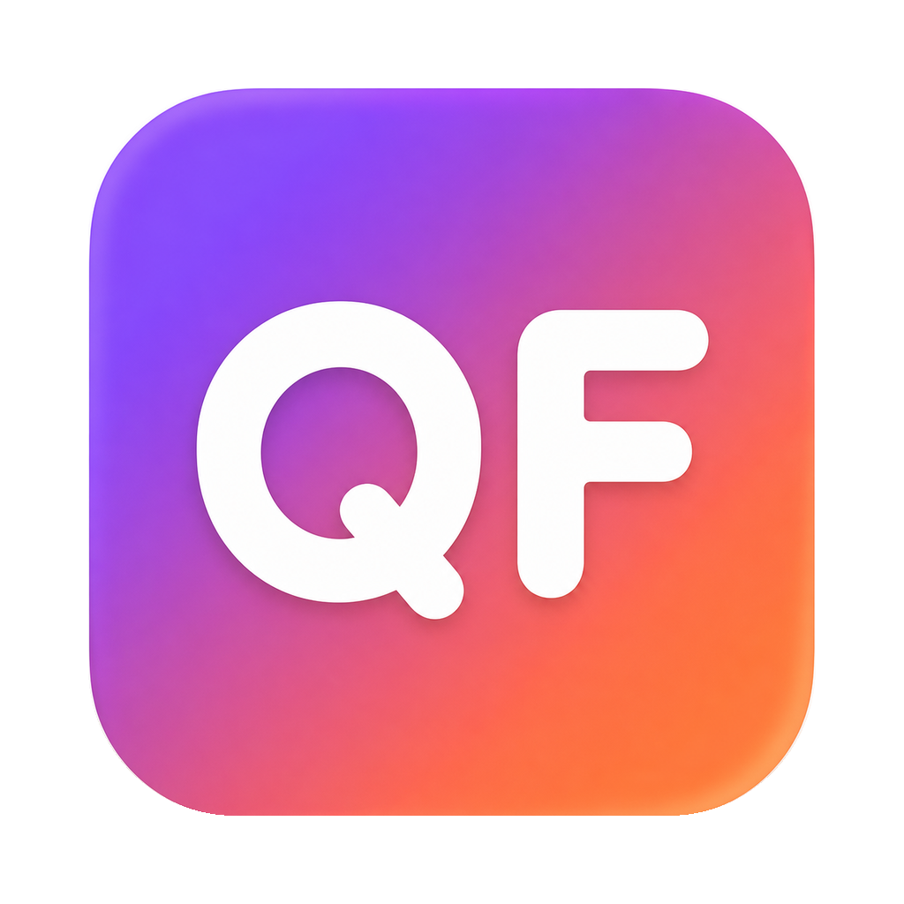

# QuotaFloat



QuotaFloat 是一款原生 macOS 桌面悬浮额度工具，用于显示 Codex、Claude 和 Kimi Coding
Plan 的 5 小时额度、周额度、重置倒计时与使用节奏。

## 当前支持

- macOS 14 或更高版本
- **仅支持 Apple Silicon（M1、M2、M3、M4 等 arm64 Mac）**
- Codex、Claude 和 Kimi Coding Plan

当前公开构建不支持 Intel Mac。

## 功能

- `CodexBarCore` 直接编译进应用，无需另外安装 CodexBar。
- 每 2 分钟只刷新当前选择显示的服务，也可以手动立即刷新。
- 支持只显示一个服务或同时显示多个服务。
- 支持始终显示，或仅在 Codex、Claude、Terminal / iTerm 中显示。
- 网络失败时保留最后一次成功数据，并标记缓存或过期状态。
- 无 Dock 运行图标，悬浮窗口置顶并记住不同应用中的位置和尺寸。

## 安装

1. 从 GitHub Releases 下载 `QuotaFloat-版本号-macOS-arm64.zip`。
2. 解压 ZIP。
3. 将 `QuotaFloat.app` 拖入 macOS 的“应用程序”文件夹。
4. 如果希望以后从程序坞启动，将“应用程序”中的 QuotaFloat 拖到程序坞固定。

不要长期直接运行“下载”目录或项目 `dist` 目录中的应用，否则移动或更新文件后程序坞入口可能失效。

## 首次打开

当前公开构建使用 ad-hoc 签名，尚未经过 Apple Developer 公证。首次打开时 macOS 可能提示无法
验证开发者。

推荐操作：

1. 在 Finder 的“应用程序”中找到 QuotaFloat。
2. 按住 Control 点击应用，选择“打开”。
3. 在确认窗口中再次点击“打开”。

如果仍被阻止，请进入“系统设置 → 隐私与安全性”，在安全提示旁点击“仍要打开”。只应从本项目
官方 GitHub Releases 下载应用。

## 使用前准备

### Codex

登录 Codex Desktop、Codex CLI 或 Codex IDE 扩展均可，不要求必须单独登录 CLI。

QuotaFloat 当前读取 `CODEX_HOME/auth.json` 中的登录缓存；未设置 `CODEX_HOME` 时默认读取
`~/.codex/auth.json`。只要 Codex Desktop 的登录信息保存在这个位置，QuotaFloat 就能直接获取
官方额度。

如果用户将 Codex 凭证配置为只保存在 macOS 钥匙串，而本机没有 `auth.json`，当前版本暂时无法
读取，需要将 Codex 凭证存储方式设置为 `file`，或通过 Codex CLI 重新生成这份登录缓存。

### Claude

安装并登录 Claude Code。QuotaFloat 优先通过 macOS 自带的 `/usr/bin/security` 读取 Claude
Code 已有 OAuth 凭证，然后请求 Anthropic 官方额度接口。QuotaFloat 不启用容易反复弹窗的
Keychain API 读取方式；但 macOS 仍可能根据用户钥匙串状态和访问策略要求一次系统授权。读取失败
时才尝试 Claude CLI 备用链路。

即使 Claude CLI 被配置为连接其他模型服务，正常的 OAuth 取数链路也不会受影响。

### Kimi

在浮窗上点击右键，选择“设置 Kimi API Key…”，输入 Kimi Coding Plan API Key。

密钥保存在：

`~/Library/Application Support/QuotaFloat/kimi-code-api-key`

文件权限为 `600`，仅当前用户可读。

## 隐私

QuotaFloat 不包含遥测、广告或用户行为统计，也不会把凭证和额度数据上传给 QuotaFloat 作者。
应用只连接当前所选模型服务对应的官方接口。

详细说明参见 [PRIVACY.md](PRIVACY.md)。

## 从源码运行

要求：

- macOS 14+
- Apple Silicon Mac
- Swift 6.2+

```bash
git clone https://github.com/Hejs26/QuotaFloat.git
cd QuotaFloat
swift run QuotaFloat
```

## 构建应用

```bash
./Scripts/package_app.sh
open dist/QuotaFloat.app
```

生成的是本机 ad-hoc 签名应用。正式公开发布若希望消除首次打开警告，需要 Apple Developer
Developer ID 签名与 Apple Notarization。

## 自检

```bash
swift run QuotaFloat --self-test
```

自检不会请求 Codex、Claude 或 Kimi。

## 开源许可

QuotaFloat 使用 [MIT License](LICENSE)。

项目依赖 `CodexBarCore`，`Package.swift` 将 CodexBar 固定到提交：

`3f3e2f4a112aa504c493ad5636c94e45df85fd03`

CodexBar 同样使用 MIT License，其原始许可文件保存在
`ThirdPartyLicenses/CodexBar-LICENSE.txt`，并会被复制进应用包。
